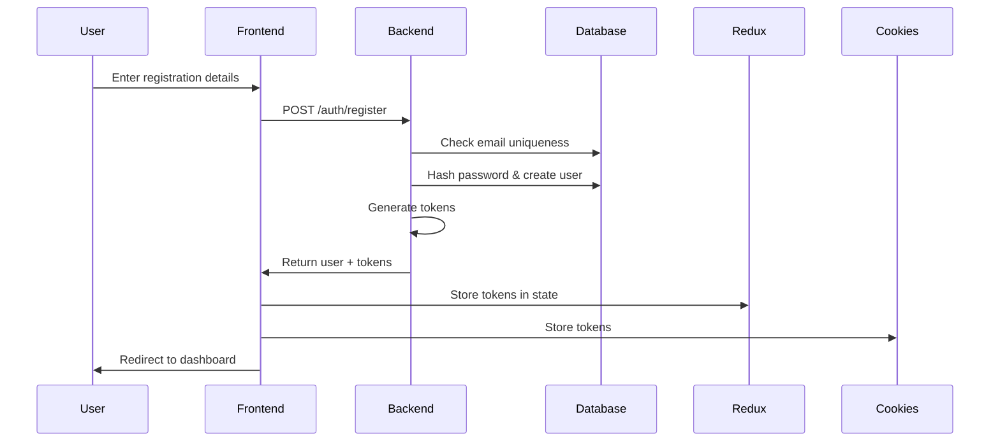
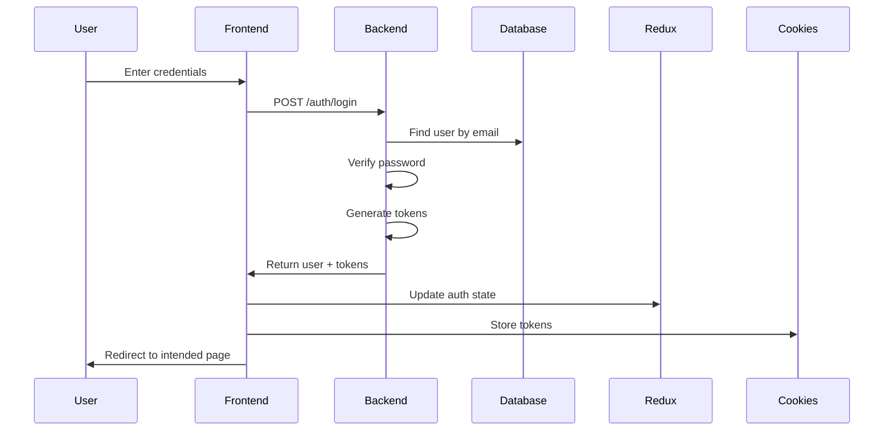
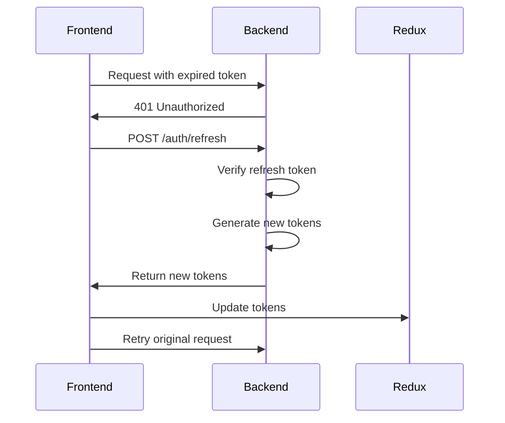

# Authentication Documentation

Complete guide to the authentication system in CraveCart, including JWT implementation, token management, and security features.

## Table of Contents

1. [Authentication Overview](#authentication-overview)
2. [JWT Implementation](#jwt-implementation)
3. [Authentication Flow](#authentication-flow)
4. [Token Management](#token-management)
5. [Security Features](#security-features)
6. [Code Implementation](#code-implementation)
7. [Best Practices](#best-practices)

## Authentication Overview

CraveCart uses a **JWT-based authentication system** with the following features:

- **Dual Token System**: Access tokens (short-lived) and refresh tokens (long-lived)
- **Cookie Storage**: Secure HTTP-only cookies for token storage
- **Role-Based Access**: Separate user and admin authentication
- **Automatic Refresh**: Seamless token refresh without user intervention
- **Session Management**: Secure session handling with proper logout

### Architecture Components

```
┌─────────────────────────────────────────────────┐
│                   Client                         │
│  (Browser with Cookies / React with Redux)       │
└──────────────────┬──────────────────────────────┘
                   │
                   ▼
┌─────────────────────────────────────────────────┐
│              API Gateway                         │
│         (Express Middleware)                     │
├─────────────────────────────────────────────────┤
│         Authentication Middleware                │
│         ├── Token Verification                   │
│         ├── User Extraction                      │
│         └── Role Validation                      │
└──────────────────┬──────────────────────────────┘
                   │
                   ▼
┌─────────────────────────────────────────────────┐
│           Protected Resources                    │
│         (API Endpoints / Data)                   │
└─────────────────────────────────────────────────┘
```

## JWT Implementation

### Token Structure

#### Access Token
```json
{
  "header": {
    "alg": "HS256",
    "typ": "JWT"
  },
  "payload": {
    "id": "user_uuid",
    "email": "user@example.com",
    "role": "user",
    "iat": 1700000000,
    "exp": 1700604800  // 7 days
  },
  "signature": "HMACSHA256(...)"
}
```

#### Refresh Token
```json
{
  "payload": {
    "id": "user_uuid",
    "tokenVersion": 1,  // For token revocation
    "iat": 1700000000,
    "exp": 1702592000  // 30 days
  }
}
```

### Token Configuration

**Backend (apps/backend/src/utils/jwt.ts)**:
```typescript
const ACCESS_TOKEN_SECRET = process.env.JWT_SECRET;
const REFRESH_TOKEN_SECRET = process.env.JWT_REFRESH_SECRET;
const ACCESS_TOKEN_EXPIRY = '7d';
const REFRESH_TOKEN_EXPIRY = '30d';
```

## Authentication Flow

### 1. Registration Flow



**Implementation**:
```typescript
// Backend: apps/backend/src/services/authService.ts
async register(userData: RegisterDTO) {
  // 1. Validate input
  const { error } = validateRegister(userData);
  if (error) throw new ValidationError(error);

  // 2. Check email uniqueness
  const exists = await prisma.user.findUnique({
    where: { email: userData.email }
  });
  if (exists) throw new ConflictError('Email already registered');

  // 3. Hash password
  const hashedPassword = await bcrypt.hash(userData.password, 10);

  // 4. Create user
  const user = await prisma.user.create({
    data: {
      ...userData,
      password: hashedPassword
    }
  });

  // 5. Generate tokens
  const accessToken = generateAccessToken(user);
  const refreshToken = generateRefreshToken(user);

  return { user, accessToken, refreshToken };
}
```

### 2. Login Flow



### 3. Token Refresh Flow



**Frontend Implementation (apps/frontend/src/hooks/baseQueryWithReauth.ts)**:
```typescript
const baseQueryWithReauth: BaseQueryFn = async (args, api, extraOptions) => {
  // Wait for mutex
  await mutex.waitForUnlock();

  let result = await baseQuery(args, api, extraOptions);

  if (result.error && result.error.status === 401) {
    if (!mutex.isLocked()) {
      const release = await mutex.acquire();

      try {
        // Try to refresh token
        const refreshResult = await baseQuery(
          { url: '/auth/refresh', method: 'POST' },
          api,
          extraOptions
        );

        if (refreshResult.data) {
          // Update tokens in store
          api.dispatch(setCredentials(refreshResult.data));
          // Retry original request
          result = await baseQuery(args, api, extraOptions);
        } else {
          api.dispatch(logout());
        }
      } finally {
        release();
      }
    } else {
      // Wait for refresh to complete
      await mutex.waitForUnlock();
      result = await baseQuery(args, api, extraOptions);
    }
  }

  return result;
};
```

## Token Management

### Cookie Storage

**Backend Cookie Configuration**:
```typescript
// Setting cookies
res.cookie('accessToken', accessToken, {
  httpOnly: true,
  secure: process.env.NODE_ENV === 'production',
  sameSite: 'strict',
  maxAge: 7 * 24 * 60 * 60 * 1000, // 7 days
  path: '/'
});

res.cookie('refreshToken', refreshToken, {
  httpOnly: true,
  secure: process.env.NODE_ENV === 'production',
  sameSite: 'strict',
  maxAge: 30 * 24 * 60 * 60 * 1000, // 30 days
  path: '/api/auth/refresh'
});
```

**Frontend Cookie Management (apps/frontend/src/features/auth/authSlice.ts)**:
```typescript
import Cookies from 'js-cookie';

const authSlice = createSlice({
  name: 'auth',
  initialState,
  reducers: {
    setCredentials: (state, action) => {
      const { accessToken, refreshToken, user } = action.payload;

      // Store in Redux state
      state.accessToken = accessToken;
      state.refreshToken = refreshToken;
      state.user = user;

      // Store in cookies
      Cookies.set('accessToken', accessToken, {
        expires: 7,
        secure: true,
        sameSite: 'strict'
      });

      Cookies.set('refreshToken', refreshToken, {
        expires: 30,
        secure: true,
        sameSite: 'strict'
      });
    },

    logout: (state) => {
      state.accessToken = null;
      state.refreshToken = null;
      state.user = null;

      Cookies.remove('accessToken');
      Cookies.remove('refreshToken');
    }
  }
});
```

### Middleware Protection

**Backend Middleware (apps/backend/src/middleware/auth.ts)**:
```typescript
export const authenticate = async (req, res, next) => {
  try {
    // 1. Extract token from header or cookie
    const token = req.headers.authorization?.split(' ')[1] ||
                  req.cookies?.accessToken;

    if (!token) {
      return res.status(401).json({
        success: false,
        error: { message: 'No token provided' }
      });
    }

    // 2. Verify token
    const decoded = jwt.verify(token, process.env.JWT_SECRET);

    // 3. Attach user to request
    req.user = decoded;

    next();
  } catch (error) {
    if (error.name === 'TokenExpiredError') {
      return res.status(401).json({
        success: false,
        error: { message: 'Token expired', code: 'TOKEN_EXPIRED' }
      });
    }

    return res.status(401).json({
      success: false,
      error: { message: 'Invalid token' }
    });
  }
};

// Role-based middleware
export const requireAdmin = (req, res, next) => {
  if (req.user?.role !== 'admin') {
    return res.status(403).json({
      success: false,
      error: { message: 'Admin access required' }
    });
  }
  next();
};
```

**Frontend Middleware (apps/frontend/src/middleware.ts)**:
```typescript
import { NextResponse } from 'next/server';
import { jwtVerify } from 'jose';

export async function middleware(request: NextRequest) {
  const token = request.cookies.get('accessToken')?.value;

  // Protected routes
  const protectedPaths = ['/orders', '/profile', '/checkout'];
  const adminPaths = ['/admin'];
  const authPaths = ['/login', '/register'];

  const path = request.nextUrl.pathname;

  // Check if path needs protection
  const isProtectedPath = protectedPaths.some(p => path.startsWith(p));
  const isAdminPath = adminPaths.some(p => path.startsWith(p));
  const isAuthPath = authPaths.some(p => path.startsWith(p));

  if (isProtectedPath || isAdminPath) {
    if (!token) {
      return NextResponse.redirect(new URL('/login', request.url));
    }

    try {
      const verified = await jwtVerify(
        token,
        new TextEncoder().encode(process.env.JWT_SECRET!)
      );

      // Check admin role for admin paths
      if (isAdminPath && verified.payload.role !== 'admin') {
        return NextResponse.redirect(new URL('/', request.url));
      }
    } catch {
      // Token invalid or expired
      return NextResponse.redirect(new URL('/login', request.url));
    }
  }

  // Redirect authenticated users away from auth pages
  if (isAuthPath && token) {
    return NextResponse.redirect(new URL('/', request.url));
  }

  return NextResponse.next();
}

export const config = {
  matcher: [
    '/orders/:path*',
    '/profile/:path*',
    '/checkout/:path*',
    '/admin/:path*',
    '/login',
    '/register'
  ]
};
```

## Security Features

### 1. Password Security

```typescript
// Password hashing
const saltRounds = 10;
const hashedPassword = await bcrypt.hash(plainPassword, saltRounds);

// Password verification
const isValid = await bcrypt.compare(plainPassword, hashedPassword);

// Password validation rules
const passwordSchema = z.string()
  .min(8, 'Password must be at least 8 characters')
  .regex(/[A-Z]/, 'Password must contain uppercase letter')
  .regex(/[a-z]/, 'Password must contain lowercase letter')
  .regex(/[0-9]/, 'Password must contain number')
  .regex(/[^A-Za-z0-9]/, 'Password must contain special character');
```

### 2. Rate Limiting

```typescript
// apps/backend/src/middleware/rateLimiter.ts
import rateLimit from 'express-rate-limit';

export const authLimiter = rateLimit({
  windowMs: 15 * 60 * 1000, // 15 minutes
  max: 5, // 5 requests per window
  message: 'Too many login attempts, please try again later',
  standardHeaders: true,
  legacyHeaders: false,
});

// Apply to routes
router.post('/login', authLimiter, authController.login);
router.post('/register', authLimiter, authController.register);
```

### 3. CORS Configuration

```typescript
// apps/backend/src/config/cors.ts
const corsOptions = {
  origin: function (origin, callback) {
    const allowedOrigins = process.env.ALLOWED_ORIGINS?.split(',') || [];
    if (!origin || allowedOrigins.includes(origin)) {
      callback(null, true);
    } else {
      callback(new Error('Not allowed by CORS'));
    }
  },
  credentials: true,
  methods: ['GET', 'POST', 'PUT', 'DELETE', 'OPTIONS'],
  allowedHeaders: ['Content-Type', 'Authorization'],
  exposedHeaders: ['X-Total-Count'],
};
```

### 4. Session Security

```typescript
// Secure session configuration
app.use(session({
  secret: process.env.SESSION_SECRET,
  resave: false,
  saveUninitialized: false,
  cookie: {
    secure: process.env.NODE_ENV === 'production',
    httpOnly: true,
    maxAge: 1000 * 60 * 60 * 24 * 7, // 7 days
    sameSite: 'strict'
  },
  store: new RedisStore({
    client: redisClient,
    prefix: 'cravecart:sess:'
  })
}));
```

## Code Implementation

### Backend Auth Service

**Location**: `apps/backend/src/services/authService.ts`

```typescript
class AuthService {
  async register(data: RegisterDTO) {
    // Implementation shown above
  }

  async login(email: string, password: string) {
    // Find user
    const user = await prisma.user.findUnique({
      where: { email }
    });

    if (!user) {
      throw new UnauthorizedError('Invalid credentials');
    }

    // Verify password
    const isValid = await bcrypt.compare(password, user.password);
    if (!isValid) {
      throw new UnauthorizedError('Invalid credentials');
    }

    // Generate tokens
    const accessToken = generateAccessToken(user);
    const refreshToken = generateRefreshToken(user);

    return { user, accessToken, refreshToken };
  }

  async refreshTokens(refreshToken: string) {
    try {
      const decoded = jwt.verify(
        refreshToken,
        process.env.JWT_REFRESH_SECRET!
      );

      const user = await prisma.user.findUnique({
        where: { id: decoded.id }
      });

      if (!user) {
        throw new UnauthorizedError('User not found');
      }

      // Generate new tokens
      const newAccessToken = generateAccessToken(user);
      const newRefreshToken = generateRefreshToken(user);

      return {
        accessToken: newAccessToken,
        refreshToken: newRefreshToken
      };
    } catch (error) {
      throw new UnauthorizedError('Invalid refresh token');
    }
  }

  async logout(userId: string) {
    // Optional: Blacklist tokens or clear server-side sessions
    // For stateless JWT, client-side cookie removal is sufficient
    return { success: true };
  }
}
```

### Frontend Auth Hooks

**Custom Hook for Auth (apps/frontend/src/hooks/useAuth.ts)**:
```typescript
export const useAuth = () => {
  const dispatch = useAppDispatch();
  const { user, accessToken } = useAppSelector(state => state.auth);
  const [loginMutation] = useLoginMutation();
  const [logoutMutation] = useLogoutMutation();

  const login = async (credentials: LoginCredentials) => {
    try {
      const result = await loginMutation(credentials).unwrap();
      dispatch(setCredentials(result));
      return result;
    } catch (error) {
      throw error;
    }
  };

  const logout = async () => {
    try {
      await logoutMutation().unwrap();
      dispatch(logoutUser());
    } catch (error) {
      // Logout locally even if API fails
      dispatch(logoutUser());
    }
  };

  return {
    user,
    isAuthenticated: !!accessToken,
    isAdmin: user?.role === 'admin',
    login,
    logout
  };
};
```

## Best Practices

### 1. Token Security
- Use strong, unique secrets for JWT signing
- Implement token rotation on refresh
- Keep access tokens short-lived (5-15 minutes in production)
- Store tokens in HTTP-only cookies
- Never expose tokens in URLs or localStorage (for sensitive apps)

### 2. Password Management
- Enforce strong password policies
- Use bcrypt with sufficient salt rounds (10+)
- Implement password reset with secure tokens
- Consider 2FA for admin accounts
- Rate limit password attempts

### 3. Session Management
- Implement proper logout (clear client and server state)
- Handle concurrent sessions appropriately
- Implement session timeout warnings
- Clear sessions on password change

### 4. Error Handling
- Don't reveal whether email exists during login failures
- Use generic error messages for security
- Log security events for monitoring
- Implement account lockout after failed attempts

### 5. HTTPS Requirements
- Always use HTTPS in production
- Set secure flag on cookies
- Implement HSTS headers
- Use TLS 1.2 or higher

### 6. Monitoring
- Log all authentication events
- Monitor for suspicious patterns
- Alert on multiple failed attempts
- Track token refresh patterns

## Troubleshooting

### Common Issues

1. **Token Expired**
   - Check token expiry configuration
   - Ensure refresh mechanism is working
   - Verify system time synchronization

2. **CORS Errors**
   - Check allowed origins configuration
   - Ensure credentials are included in requests
   - Verify preflight requests are handled

3. **Cookie Not Set**
   - Check secure flag in development
   - Verify SameSite settings
   - Ensure domain configuration is correct

4. **401 Loops**
   - Check refresh token validity
   - Verify mutex lock is working
   - Ensure token storage is persistent

---

This authentication system provides a secure, scalable foundation for the CraveCart application with industry-standard security practices.